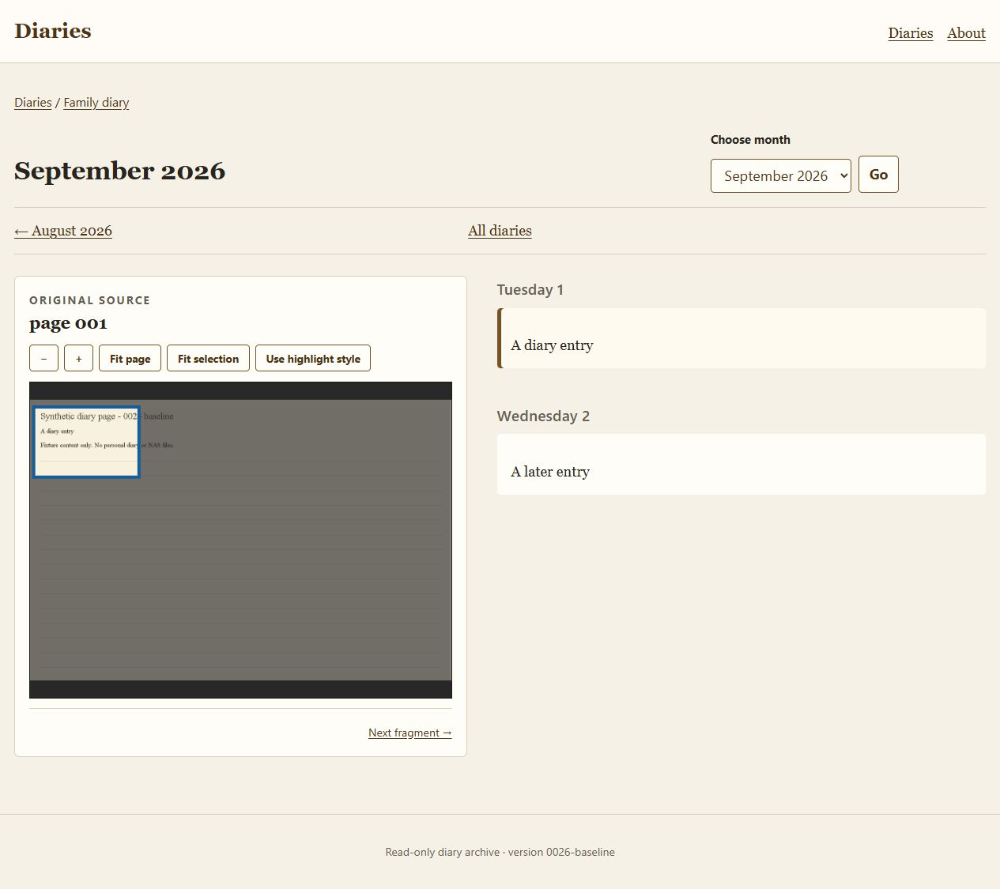
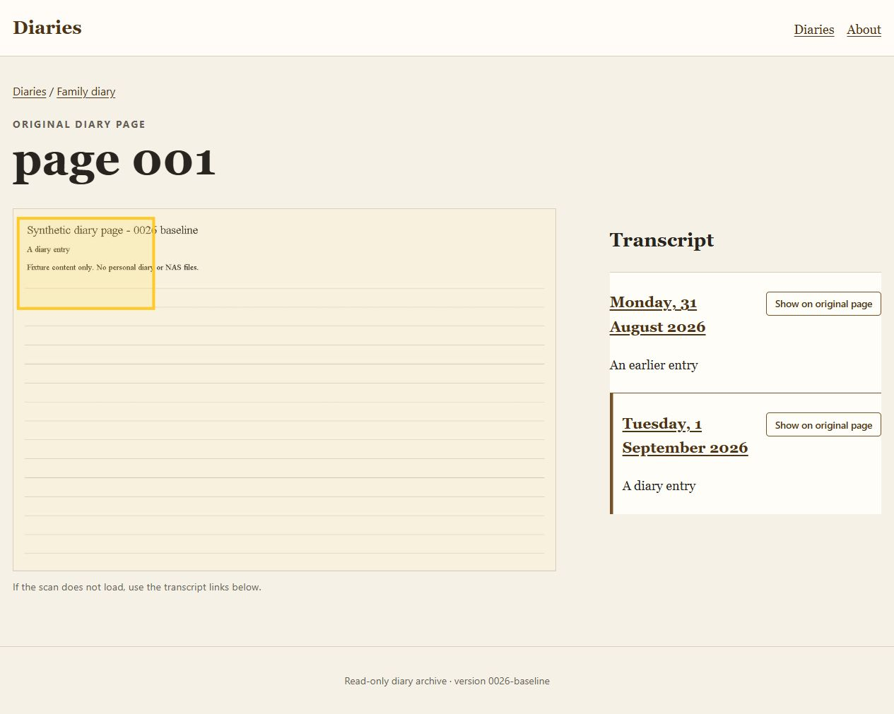

# 0026 Step 1 — Frozen web baseline

Completed 2026-09-28. This establishes reproducible pre-0026 reader behavior. No application source, broker ACL, database, NAS content, deployment configuration or production authoring gate was changed. Steps 2–16 remain pending.

## Identity and execution mode

| Repository | Branch | HEAD at capture | Working tree at capture |
| --- | --- | --- | --- |
| diaries | main | `37a2a8d9ac57f19dbcc80d1f10a34f1e86adab75` | Clean |
| diaries-web | main | `e8d3470d6e65cf126319625a16fb308d7729454b` | Clean |
| diaries-responder | main | `50ae8b4a25052c2bc714da404a199066d8ad7258` | Clean |

`baseline.json` records capture time and identities. `source-sha256.csv` fingerprints 267 files: web and responder main/test source/resources, web example configs/build/guardrails/docs/Dockerfile, parent Gradle wrapper/catalog/build inputs and committed broker files. No ignored password file or local configuration is copied. The clean commits plus exact worktree hashes define this baseline; active source remains authoritative for future work. `source-verification.json` confirms every recorded file remained unchanged after testing and browser capture. No commit, tag, stash or push was made.

The local environment had **development-infrastructure** running: PostgreSQL and Mosquitto from `compose.development-infrastructure.yaml`, project `diaries-development-infrastructure`. Tests used their own Testcontainers broker, and screenshots used a separate direct Java synthetic harness. Neither used the existing development database or broker.

`local-services.json` and `local-container-identities.txt` preserve read-only container tags, image IDs, ports, health and Compose identity. No reader/responder container was running; the initial port inspection found no listeners on 8080/8081/8082. Consequently no live local reader/responder tag or embedded version was available. This observation is limited to the inspected local services/ports, not all possible remote deployments.

Production was not accessed. No production endpoint or deployment repository was supplied for this step. Production reader/responder tags, embedded metadata, schema and authoring-gate state remain **unverified**, to be established in the release steps. Historical completion records do not prove deployment. The requirement to leave production ImageFragment writes disabled remains in force.

## Prior evidence and current contract review

Read the workspace and web guardrails, parent README/architecture, web README, this feature/plan, completed 0023 README/IMPLEMENTATION, completed 0025 Step 1 and Step 15 close-out/revalidation evidence. In particular:

- 0023 establishes Page-owned chronology with optional Marquee. Its implementation record explicitly leaves deployed-state capture/runtime smoke/deployment activities unclaimed, despite its folder being under `complete`.
- 0025 Step 15 proves the responder lifecycle on disposable infrastructure and explicitly does not claim production migration/deployment or authoring enablement. Its historical in-progress paths now resolve under the completed 0025 directory.
- Current web `FragmentItem` accepts nullable `imageId`, explicit IMAGE and legacy null type; `effectiveType()` treats only null as MARQUEE. `ProjectionSnapshot` resolves Page/Diary from `Fragment.pageId`; IMAGE chronology exists with `unsupportedImageFragments` diagnostics but no Image catalogue resolution/rendering.
- Current `EntityType`/reader filters cover only Diary, Page, Fragment and Marquee. The successful catalogue integration test proves ignored Image traffic does not alter existing chronology; it does **not** prove IMAGE rendering.
- Current responder `FragmentPublishDTO` contains `pageId`, `type`, nullable `imageId` and compatibility `marqueeId`; `ImagePublishDTO` publishes metadata to `diaries/images/{id}`, with zero-byte removal. Caption/alt defaults are empty strings; retained Image data contains no absolute URL or bytes. These are reviewed source contracts, not newly captured production traffic.
- Web runtime configuration has `http`, `mqtt`, `projection`, `content`, `site`. `content` currently has only `responderBaseUrl`, `publicResponderBaseUrl`, `diariesPath`; no `filesPath`. Page URLs use the public base; legacy embedded media uses `/files/`. MQTT credentials are external environment variables and are omitted from evidence.

The web README still describes some pre-0023 Marquee-derived ownership. That is a known documentation discrepancy; this baseline follows current source and records it for the planned documentation update rather than changing reader documentation during the freeze.

## Tests and build

From the parent `diaries` directory:

```powershell
.\gradlew.bat :diaries-web:test :diaries-web:build --rerun-tasks --console=plain
```

**50 tests passed; zero failures, errors or skips. Build passed.** Counts are read from this run's XML, not copied from an older total.

| Suite | Tests |
| --- | ---: |
| ConfigLoaderTest | 2 |
| WebServerTest | 6 |
| PageItemTest | 12 |
| RectangleItemTest | 2 |
| MqttProjectionIntegrationTest | 2 |
| RetainedContractTest | 11 |
| ProjectionServiceTest | 11 |
| RenderingSafetyTest | 4 |

Both Docker-gated tests executed against a disposable authenticated Mosquitto 2.0.22 container. Coverage includes retained replay, live update, tombstone, reader reconnect, forbidden publication, and unchanged visible chronology across Image catalogue population/restarts. See `test-reports/`, `test-summary.csv` and `gradle-test-build.log`.

The compiler reported existing deprecated API use in ConfigLoader; it did not fail the build. Local sandbox access initially prevented Docker inspection and Git's ownership check; process-local Git `safe.directory` and approved execution with the existing Docker/Gradle access resolved those constraints without changing global Git configuration.

`local-build-info.properties` records the newly built web artifact: version `0.1.0-SNAPSHOT`, commit `e8d3470d...`, build time 2026-09-28 08:44:09 BST. `artifact-sha256.csv` records ordinary/fat JAR hashes. These are local build identities, not published image tags. The browser harness deliberately displays `0026-baseline`/synthetic metadata and must not be mistaken for a deployed artifact.

## Browser and HTTP baseline

The evidence-only `BaselineSite.java` uses the unchanged `TestData.readyProjection()` and real `WebServer`, templates, CSS, JavaScript and sanitizer. Only runtime content routing and test BuildInfo are substituted. It generates a 1200×800 JPEG in a private temporary directory under ignored web build output and serves it on loopback. No new application code or test is added to the web submodule.

The synthetic fixture has Diaries 10/11/12, Pages 22/23/24, MARQUEE Fragments 32/33/34 and Marquees 43/44/45. Fragment 32 is August 31 on Page 22; 33 is September 1 on Page 22; 34 is September 2 on Page 23. The source fixture's script-bearing fragment text renders as sanitized `A diary entry`.

| Check | Observed result |
| --- | --- |
| September month, fragment 33 | Page 001 scan loads, selected region appears, ordered September 1/2 text is visible |
| Enter on fragment 34 text | Page 002 and selected region update; pressed state moves; URL becomes `?fragment=34#fragment-34` |
| Reload / Back | Reload preserves 34; Back restores 33 and Page 001 |
| `/fragments/33` | HTTP 302 to `/diaries/11/2026/09?fragment=33#fragment-33` |
| `/diaries/11/2026/09/02` | HTTP 302 to month with fragment 34 selected |
| `/diaries/11/pages/22#fragment-33` | Page scan, both transcripts and selected fragment 33 overlay render |
| Source-page earlier-fragment button | Overlay/pressed state moves to 32, but URL remains `#fragment-33`; reload restores 33. Existing history limitation, not a new regression |
| Browser console | No warnings or errors recorded |
| Ready/about/month/source HTTP | All return 200; restrictive CSP recorded |

`browser-observations.json` retains URLs and DOM snapshots for every check; `http-observations.json` retains response status/redirect/CSP. `synthetic-health.json` and `synthetic-about.html` are from the fixture. The health payload says MQTT is connected because TestData drives the projection's replay/acknowledgement events; the screenshot harness itself starts **no MQTT client**. Real MQTT evidence is solely the integration suite.

The final comparison of saved URL and DOM evidence corrected an initial assumption that source-page button selection survived reload. In `static/js/diaries.js`, the source-page selector changes overlay/classes/pressed state, but reads the hash only at initialization and does not update history. This existing limitation is recorded for Step 10; it is not fixed or treated as passing persistence here. The month reader's separate history handling did pass. `final-review.json` records the corrected result.

Screenshots use the default browser viewport (1265 px wide), full page:





`runtime-config.example.json` preserves the committed credential-free schema; `runtime-config.synthetic.json` records the actual harness config. This is not a capture of any private live config.

## Reproduction and cleanup

See [FIXTURE-PLAN.md](FIXTURE-PLAN.md) for isolation, future MQTT fixtures and ownership. Start the browser fixture from `diaries`:

For an exact historical reproduction, first verify the source inventory against the recorded clean commits; running this harness against future source changes is a comparison run, not the original baseline. Do not reset an existing working tree to obtain that reproduction.

```powershell
.\gradlew.bat --init-script 'change-control/in-progress/0026-FEAT - render ImageFragments in diaries-web/evidence/Step 1/baseline.init.gradle' :diaries-web:run0026Baseline --console=plain
```

Open the month/source URLs above on `http://127.0.0.1:18082`. Port 18083 serves only the synthetic Page scans. The launcher fails if ports are occupied; it must not stop another process. To stop this run, create `diaries-web/build/0026-baseline/stop`. The loop exits, closes both owned HTTP services and removes only its generated JPEG and unique image directory. For a subsequent run, remove only that exact owned stop marker after verifying the old process has exited.

`browser-harness.log` records successful startup and graceful shutdown. `fixture-runtime.txt` records the process and unique directory; `cleanup.json` records the directory gone and loopback ports free after shutdown. Testcontainers removed its owned test broker; the original development services remained running. Generated Gradle outputs and the stop marker remain under ignored build directories; evidence remains here.

## Scope and follow-up

Only this feature README/implementation status and the Step 1 evidence package changed. No responder/client tests were rerun: their implementation did not change and this step requires the existing web baseline suite. No production deployment, NAS route, live responder binary or authoring-gate validation is claimed. Step 2 can now use this known working tree and baseline; production readiness remains later work.
